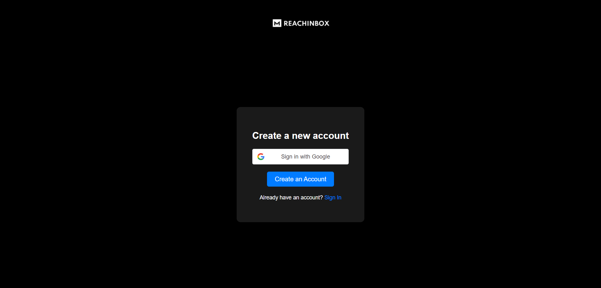
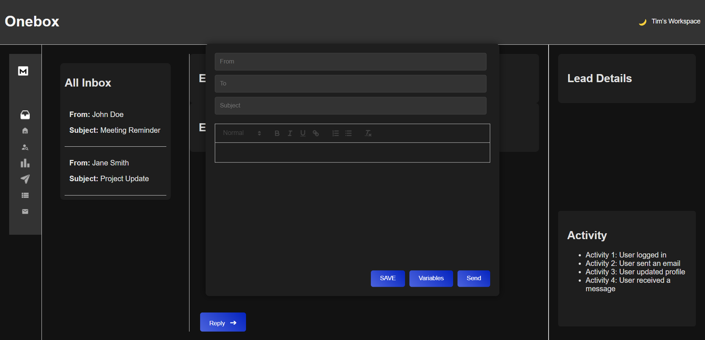
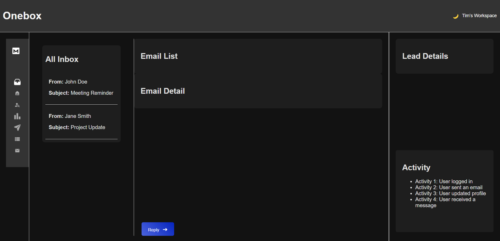
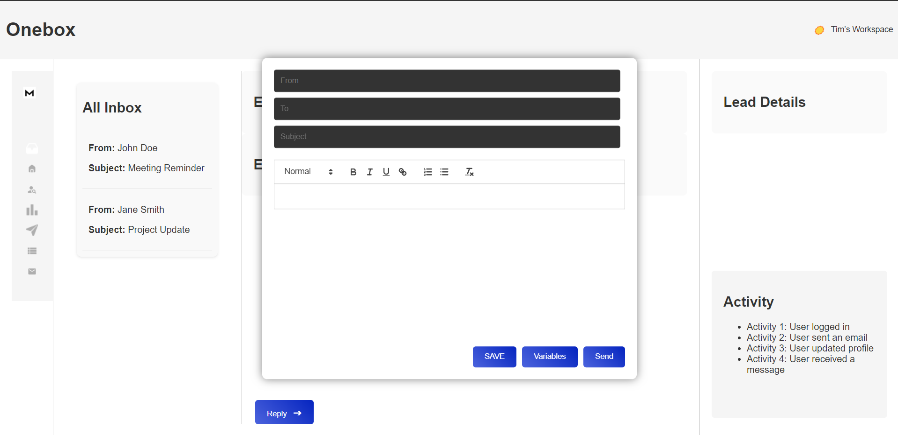

# Onebox Project

## Description
Onebox is a web application designed to manage and interact with email replies. The application has a frontend built with React.js and a backend powered by Node.js and Express. It includes features such as email management, reply functionality, and user activity tracking.

## Project Screenshot

Here's a screenshot of the project:

###  Implementthe login page- Use the design provided
### Onceloggedin the user should be taken to the onebox screen. /google-login

### keyboard shortcuts in onebox- “D” should delete. “R” should open Reply box
### custom text editor (Need to Add Custom button in editor like “SAVE” and “Variables”)


### Clicking on send should send Reply


### light and dark mode



## Installation

### Clone the Repository
Clone the repository to your local machine:
```bash
git clone https://github.com/Aniraai/onbox.git

Navigate to the Project Directory

bash

cd your-repository-name

Install Dependencies

    Frontend:
    Navigate to the frontend directory and install the required dependencies:

    bash

cd frontend
npm install

Backend:
Navigate to the backend directory and install the required dependencies:

bash

    cd ../backend
    npm install

Running the Project
Start the Backend Server

Navigate to the backend directory and start the server:

bash

cd backend
npm start

The backend server will be available at http://localhost:3001.
Start the Frontend Application

Navigate to the frontend directory and start the application:

bash

cd ../frontend
npm start

The frontend application will be available at http://localhost:3000.

Ngrok Setup

To expose your local server to the internet, use Ngrok:

    Install Ngrok:
    Follow the installation instructions on the Ngrok website.

    Start Ngrok for the Backend:

    bash

ngrok http 3001

Ngrok will provide a public URL (e.g., https://your-ngrok-url.ngrok-free.app) that you can use to access your backend from the internet.

Update Frontend Configuration:
In your frontend code, update the API base URL to use the Ngrok URL provided by Ngrok. For example:

javascript

    const apiUrl = 'https://your-ngrok-url.ngrok-free.app/api/replies';

API Endpoints
GET /api/replies

Fetches all replies.

Response:

    200 OK: Returns a JSON array of all replies.
    500 Internal Server Error: Error fetching replies.

POST /api/replies

Creates a new reply.

Request Body:

json

{
    "thread_id": "string",
    "from": "string",
    "to": "string",
    "subject": "string",
    "body": "string"
}

Response:

    201 Created: Returns the created reply.
    400 Bad Request: If any required fields are missing.
    500 Internal Server Error: Error creating reply.

Troubleshooting

    404 Not Found: Ensure that your backend routes are correctly configured and that the server is running. Check the route definitions and ensure they match your API calls.
    500 Internal Server Error: Check the backend server logs for detailed error messages. Ensure that your database and other services are correctly set up and configured.
    Connection Issues: Verify that Ngrok is correctly forwarding requests and that your firewall or network settings are not blocking connections. Ensure that the frontend is correctly using the Ngrok URL for API calls.

Additional Information

    Frontend: Built with React.js. Make sure to handle routing and state management effectively. Ensure that the fetchEmails function uses the correct API endpoint.
    Backend: Built with Node.js and Express. Ensure that CORS is configured correctly to allow requests from the frontend. Check database connectivity and ensure models are properly defined.
    Ngrok: Useful for exposing local servers to the internet for testing and development. Be aware of Ngrok's free plan limitations and potential connection timeouts.

Contributing

Feel free to fork the repository, make improvements, and submit pull requests. Ensure that all changes are well-documented and tested.


###Final Steps

1. **Save the `README.md` File**: Create a new file named `README.md` in the root directory of your project and paste the content above into it.

2. **Commit and Push README.md**:
   ```bash
   git add README.md
   git commit -m "Add README.md with setup instructions"
   git push